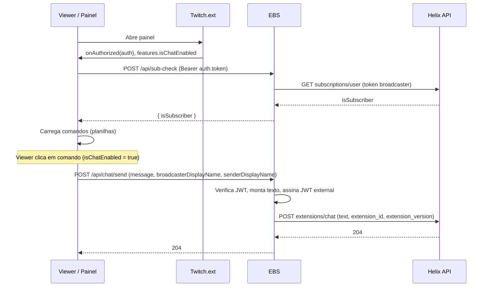
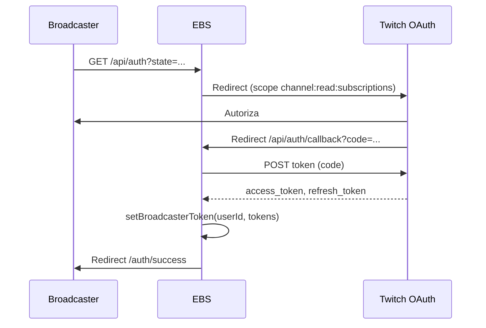

# Fluxo da aplicação

Documento que descreve o fluxo atual da extensão Twitch (panel, chat, sub-check e configuração), após a unificação em torno do **Send Extension Chat Message** e remoção do login do viewer.

---

## Visão geral

- **Chat:** único fluxo via **Send Extension Chat Message** (Helix `extensions/chat`), com JWT assinado pelo EBS. Nenhuma autenticação do viewer para enviar mensagens.
- **Verificação de inscrito:** usa token OAuth do **broadcaster** (uma vez por canal), armazenado no EBS e usado em `/api/sub-check`.
- **Configuração:** broadcaster pode definir a URL do EBS na tela de config da extensão; o painel usa essa base para chamar as APIs.

---

## 1. Abertura do painel (viewer)

Quando o viewer abre o painel da extensão na página do canal:

1. O Twitch carrega o iframe e injeta o Helper (`window.Twitch.ext`).
2. O painel registra `Twitch.ext.onAuthorized(auth)` e recebe:
   - `auth.token` — JWT para chamadas ao EBS
   - `auth.channelId` — ID do canal (broadcaster)
   - `auth.helixToken`, `auth.clientId` — para chamadas Helix no frontend
3. O painel lê **`Twitch.ext.features.isChatEnabled`** e guarda em estado. Se `false`, desabilita os botões de envio e exibe aviso.
4. Opcionalmente registra **`Twitch.ext.features.onChanged`** para atualizar `isChatEnabled` se o broadcaster mudar a permissão.
5. Com `auth.helixToken` e `auth.clientId`:
   - Chama **GET Helix Users** (sem `id`) para obter o perfil de quem está vendo (nome/avatar) → `senderDisplayName`.
   - Chama **GET Helix Users?id={channelId}** para obter o nome do canal → `broadcasterDisplayName`.
6. Chama **POST /api/sub-check** com `Authorization: Bearer {auth.token}`; o EBS valida o JWT, usa o token do broadcaster do ebs-store e consulta a Helix **Check User Subscription** → retorna `{ isSubscriber }`.
7. Carrega a lista de comandos a partir das planilhas configuradas (seguidores e inscritos).
8. Exibe a UI: comandos para todos, comandos extras para inscritos (se `isSubscriber`), pesquisa e categorias.

**Resumo:** ao abrir, o painel obtém contexto (canal, viewer, isChatEnabled, é inscrito?) e a lista de comandos; não há login OAuth do viewer.

---

## 2. Envio de mensagem no chat (clique no botão)

Quando o viewer clica em um comando e o chat da extensão está habilitado (`isChatEnabled === true`):

1. O painel aplica **rate limit** (12 mensagens por minuto); se excedido, mostra “Aguarde X segundos” e não envia.
2. Chama **`sendChatMessage(auth, commandText, broadcasterDisplayName, userDisplayName)`** em `lib/twitch.js`.
3. **POST /api/chat/send** com:
   - Header: `Authorization: Bearer {auth.token}` (JWT do frontend)
   - Body: `{ message, broadcasterDisplayName, senderDisplayName }`
4. No EBS:
   - Valida o JWT do frontend com `EXTENSION_SECRET` e extrai `channel_id` e `user_id`.
   - Monta o texto: **`{broadcasterDisplayName}: !{comando} enviado por {senderDisplayName}`** (máx. 280 caracteres).
   - Gera um **novo JWT** com role `external`, `channel_id`, `user_id`, `exp` (ex.: 60s), assinado com `EXTENSION_SECRET`.
   - Chama **POST https://api.twitch.tv/helix/extensions/chat** com:
     - Query: `broadcaster_id={channel_id}`
     - Headers: `Authorization: Bearer {JWT assinado}`, `Client-Id: EXTENSION_CLIENT_ID`
     - Body: `{ text, extension_id, extension_version }`
5. A mensagem aparece no chat **em nome da extensão**, com o conteúdo no formato acima.

Não há uso de token OAuth do viewer; o envio depende apenas do JWT da extensão e do EBS.

---

## 3. Verificação de inscrito (sub-check)

- O painel envia **POST /api/sub-check** com o JWT do frontend (mesmo token de `onAuthorized`).
- O EBS:
  - Valida o JWT e extrai `channel_id` (broadcaster) e `user_id` (viewer).
  - Obtém o token OAuth do **broadcaster** em memória (`ebs-store`): `getBroadcasterToken(broadcasterId)`.
  - Se não houver token, responde `{ isSubscriber: false }`.
  - Se houver, chama **GET Helix Subscriptions User** com o token do broadcaster e retorna `{ isSubscriber: true/false }`.
- Esse token do broadcaster vem do **fluxo de autorização do broadcaster** (uma vez por canal), não do viewer.

---

## 4. Autorização do broadcaster (uma vez por canal)

Para o sub-check funcionar, o broadcaster precisa autorizar a extensão uma vez:

1. O streamer acessa **GET /api/auth?state=...** (por exemplo a partir do dashboard da extensão ou de um link configurado).
2. O EBS redireciona para a **Twitch OAuth** com escopo `channel:read:subscriptions`.
3. Após o usuário autorizar, a Twitch redireciona para **GET /api/auth/callback?code=...&state=...**.
4. O EBS troca o `code` por access/refresh token e obtém o `user_id` via Helix Users.
5. Armazena o token com **`setBroadcasterToken(userId, { accessToken, refreshToken, expiresAt })`**.
6. Redireciona para `/auth/success` ou para a URL em `state`.

Não existe mais fluxo de autorização para o **viewer**; apenas o broadcaster faz OAuth (para sub-check).

---

## 5. Configuração da extensão (broadcaster)

- **Config (dashboard):** em `index?view=config` o broadcaster vê a tela de configuração. Pode definir a **URL base do EBS** (ex.: `https://seu-dominio.vercel.app`). O valor é salvo com `Twitch.ext.configuration.set('broadcaster', '1', content)` em JSON `{ ebsBaseUrl }`.
- **Runtime:** o painel usa `getApiBaseUrl()` em `lib/config.js`, que lê `ebsBaseUrl` da config do broadcaster ou `NEXT_PUBLIC_EBS_URL`. As chamadas a `/api/chat/send` e `/api/sub-check` usam essa base quando não estão na mesma origem.

---

## 6. Diagrama de sequência — envio de chat

---

## 7. Diagrama de sequência — autorização do broadcaster

---

## 8. Arquivos principais

| Área | Arquivos |
|------|----------|
| Painel e config | `app/page.jsx`, `app/index/page.jsx`, `app/components/PanelPage.jsx` |
| Chat (Send Extension Chat Message) | `app/api/chat/send/route.js`, `lib/twitch.js` |
| Sub-check | `app/api/sub-check/route.js` |
| Auth (só broadcaster) | `app/api/auth/route.js`, `app/api/auth/callback/route.js`, `app/auth/success/page.jsx` |
| Store de tokens | `lib/ebs-store.js` (apenas broadcaster) |
| Config runtime | `lib/config.js` (getApiBaseUrl, getChatSendUrl, getSubCheckUrl) |

---

## 9. Variáveis de ambiente relevantes

| Variável | Uso |
|----------|-----|
| `EXTENSION_SECRET` | Verificar JWT do frontend e assinar JWT external (chat). |
| `EXTENSION_CLIENT_ID` / `TWITCH_CLIENT_ID` | Helix extensions/chat e demais chamadas Helix. |
| `EXTENSION_VERSION` | Versão enviada em `extension_version` no extensions/chat (default 0.0.1). |
| `TWITCH_CLIENT_ID`, `TWITCH_CLIENT_SECRET` | OAuth do broadcaster (callback e refresh no sub-check). |
| `NEXT_PUBLIC_APP_URL` | Redirect URI do OAuth e links de sucesso. |
| `NEXT_PUBLIC_EBS_URL` | (Opcional) URL base do EBS no frontend quando diferente da origem. |

OAuth é usado **apenas para o broadcaster** (sub-check); não há login do viewer nem variáveis exclusivas de viewer.
